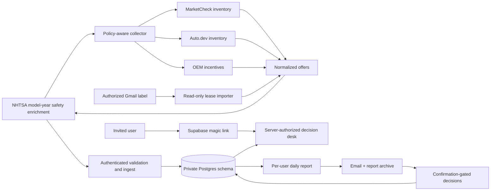

# AutoHunter

**AutoHunter** is a private vehicle-intelligence and decision product for households shopping used
cars and leases. It turns licensed inventory, authorized alerts, OEM programs, real listing photos,
package evidence, and normalized economics into one review queue and one evidence-rich daily report.

_a Northglass Product_

The canonical production origin is `https://autohunter.northglass.io`. The historical `catcht`
directory and database schema names are compatibility details retained to preserve listing IDs,
evidence, decisions, and report history through the rebrand.

## What it does

- Separate EV, gas/PHEV, lease, and enthusiast lanes with per-user saved searches.
- Real listing photos and direct links to the original dealer or authorized source.
- Hard model, trim, body-style, year, price, mileage, distance, payment, drive-off, and annual-mile filters.
- One-click 2018–2020 S560/S450 sedan presets under $25,000, readable equipment checkboxes, and
  a protected [W222 buying guide](https://autohunter.northglass.io/guides/w222) with Mercedes sources.
- Equipment evidence that keeps **confirmed**, **expected**, and **unknown** claims distinct.
- Explicit recognition of manufacturer systems such as BMW Highway Assistant, Cadillac Super
  Cruise, Rivian Enhanced Highway Assist, Audi adaptive cruise assist, Genesis HDA II, Volvo Pilot
  Assist, Mercedes-Benz DISTRONIC/Active Steering Assist, and Porsche InnoDrive/Active Lane Keeping.
- Purchase and lease scoring that rewards economics, family fit, and verified desired equipment.
- Active lease offers, signed benchmarks, and incomplete market signals shown as different roles.
- Durable, reversible Interested and Pass decisions for each household member.
- Invite-only Supabase magic links; no password database and no open signup.
- Daily email and in-app reports with a bottom line, new/changed finds, normalized lease sections,
  caveats, and a source-health snapshot.
- Complete plain-text email candidates, price-drop context and S-Class inspection checks. Sources
  whose latest result is over 48 hours old are visibly stale rather than counted as healthy.
- Canonical VIN/source deduplication while preserving private per-user matches and decisions.
- Bounded NHTSA 5-Star and model-year recall context, with a direct official VIN-recall check and no
  bulk VIN lookup.

## Authorized source model

AutoHunter does not evade bot controls or turn a provider denial into fake coverage.

| Source | Use | Method | Default |
|---|---|---|---|
| MarketCheck active inventory | used, new, CPO | licensed API | enabled when credentialed |
| Auto.dev vehicle listings | used, new, CPO | licensed API | enabled when credentialed |
| MarketCheck OEM incentives | structured lease programs | licensed API/plan entitlement | enabled when credentialed |
| NHTSA safety data | model-year crash ratings and recall campaigns | bounded first-party API | enabled |
| AutoHunter lease-input label | dealer alerts and user-authorized notifications | read-only GOG Gmail import | optional |
| Normalized ingest | dealer/partner feeds and manual imports | authenticated server API | supported extension |
| Leasehackr-derived inputs | signed deals and editorial signals | authorized email or operator import only | no crawler |
| Legacy manual-car monitor | original enthusiast migration | disabled Camoufox path | migration-only |

Direct scheduled crawling of Leasehackr, Cars.com, CarGurus, TrueCar, or other sources whose terms
disallow it is intentionally not included. Those sources can enter through a licensed upstream
provider, a user-owned notification, a written partner feed, or a bounded manual import. AutoHunter
has no CAPTCHA-solving integration.

## Architecture



The browser gets only Supabase Auth identity. Application tables stay in the private `catcht`
schema, outside the Supabase Data API, and every protected page, route, and Server Action maps the
authenticated user to an active invited profile. The collector receives opaque search IDs and no
email addresses, roles, cookies, or Auth IDs.

## Repository map

| Path | Purpose |
|---|---|
| `catcht/` | Next.js app, Auth integration, private data access, ranking, reports, and email |
| `catcht/public/brand/` | tested AutoHunter symbol, wordmark, lockup, app-icon, and favicon exports |
| `catcht/supabase/` | additive migrations, Auth templates, local seed, and pgTAP contracts |
| `collector/` | licensed/authorized adapters, orchestration, source health, and bounded legacy code |
| `collector/platform.example.json` | portable source policy and example search definitions |
| `.github/workflows/collector.yml` | daily hosted collection with secret-store injection |
| `docs/adr/012-autohunter-product-and-source-architecture.md` | current product/source decision |
| `docs/adr/013-nhtsa-safety-evidence.md` | bounded official safety-evidence decision |
| `docs/adr/014-production-cutover-and-scheduler-ownership.md` | production scheduler and compatibility ownership |
| `docs/standalone.md` | full deployment and operations runbook |
| `docs/deployment-checklist.md` | compact production checklist |
| `docs/STATUS.md` | current verified implementation and cutover boundary |

## Local verification

Prerequisites: Node.js 22, npm, Docker, Supabase CLI, and Chromium installed by Playwright.

```bash
git clone https://github.com/Northglass-Labs/autohunter.git
cd autohunter
nvm use

(cd catcht && npm ci && npm test && npm run test:db && npm run test:e2e && npm run lint && npm run build)
(cd collector && npm ci && npm test)
```

`npm run test:e2e` resets only this repository's local Supabase project, captures real magic-link
emails in Mailpit, and runs the household-isolation stories in desktop Chromium and a Pixel-sized
mobile viewport. It does not touch a linked hosted database.

GitHub CI runs the unit, lint, build, dependency, clean-database pgTAP, and full desktop/mobile E2E
gates on every `main` push and pull request. Every third-party action is pinned to an immutable
commit and checkout credentials are not persisted.

## Production setup

1. Create a Supabase project and apply the checked-in migrations after a dry run.
2. Configure the invite-only before-user-created hook and the checked-in AutoHunter email templates.
3. Deploy `catcht/` to Vercel with the variables in [`catcht/.env.example`](catcht/.env.example).
4. Verify `carhunt@northglass.io` (or another Northglass sender) with the configured mail provider.
5. Map `autohunter.northglass.io`, set the exact Auth site/redirect URLs, and test one administrator
   magic link before enabling any additional digest recipient.
6. Add licensed provider and application credentials to a scheduler secret store, then run the
   collector health command before the first write cycle.

```bash
cd collector
cp platform.example.json platform.local.json
npm run platform:health -- --config platform.local.json
npm run platform:cycle -- --config platform.local.json
```

Primary collector variables are `AUTOHUNTER_APP_URL`, `AUTOHUNTER_INGEST_SECRET`,
`AUTOHUNTER_CRON_SECRET`, `MARKETCHECK_API_KEY`, optional `AUTODEV_API_KEY`, and optional
`AUTOHUNTER_CONFIG`. Historical `CAR_HUNT_*`/`CATCHT_*` names are read only as migration fallbacks.

The hosted scheduler invokes the licensed inventory cycle at 10:17 UTC. Report eligibility uses a
23-hour minimum interval so ordinary scheduler jitter does not skip a calendar day, while the
profile-scoped run key keeps retries idempotent. The optional Gmail bridge is a separate read-only,
fixed-profile operation and is not required by the web product.
Manual GitHub workflow dispatch defaults to `collection_only=true`, which runs `platform:collect`
and never invokes the digest endpoint. Daily scheduled cycles retain the existing digest cadence.
Use collection-only mode for deliberate live verification after changing searches; provider request
and detail limits still apply.

## Security and privacy

- No secrets in repository files, scheduler arguments, listing URLs, email HTML, or browser bundles.
- Provider credentials are sent only in the mechanism required by that provider and stripped from
  persisted URLs.
- Mailbox imports are read-only, label-bounded, and persist normalized offer facts—not message
  bodies, recipient addresses, or arbitrary mailbox content.
- Listing facts are canonical; searches, matches, decisions, digest history, and resend state are
  profile-scoped.
- Scheduler completion payloads contain aggregate counts only; profile and mail-provider identifiers
  stay in private report state and out of public automation logs.
- Signed email actions open a confirmation page before mutation so link scanners cannot change a
  queue.
- Provider states are recorded as `success`, `empty`, `unavailable`, `challenged`, or `failed`.
- Both npm packages must audit at zero known vulnerabilities before deployment.

Report suspected vulnerabilities privately according to [`SECURITY.md`](SECURITY.md).

## Operational boundaries

AutoHunter is a private, invite-only decision tool—not a public marketplace, broker, dealer, or
financing service. It does not contact sellers, negotiate, submit credit applications, or guarantee
equipment. Window stickers, VIN build sheets, recalls, title/history reports, subscription status,
and physical vehicle condition still require buyer verification before purchase or lease.

See [`docs/standalone.md`](docs/standalone.md) for the complete runbook.
